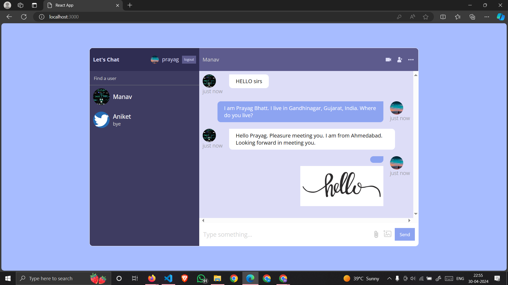
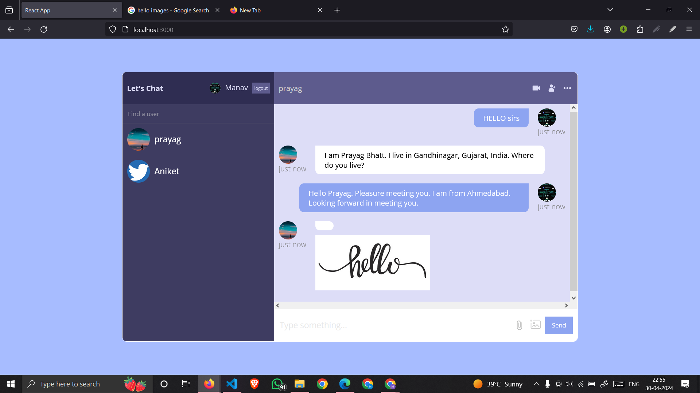

# ChatBot with Chat Application Integration

This repository contains a project that integrates a chatbot with a chat application, enabling users to interact with the chatbot and other users simultaneously within the application interface.

### Overview
The project combines the functionalities of a chatbot and a chat application, offering a seamless user experience. Users can chat with the bot as well as with other users, all within the same application interface.

### You may send images to other users and could even send an image to the ChatBOT!!

## Features

###    Chatbot Integration: The chatbot is seamlessly integrated into the chat application.

###    Real-time Responses: Users receive responses from the chatbot and other users in real-time.

###    Customizable: The project is designed to be easily customizable to fit different use cases and environments.

###    User-friendly Interface: The chat application provides a user-friendly interface for interacting with the chatbot and other users.

###    User Registration: New users need to register with their email, name, password, and user image. A one-time code will be sent to the email address for confirmation.

###    Private Messaging: Users can search for other users and message them privately.

## Installation

To run the project locally, follow these steps:

    Clone the repository:

    bash

git clone https://github.com/Manav7603/ChatBot-with-Chat-Application.git

Navigate to the project directory:

bash

cd ChatBot-with-Chat-Application

Install dependencies:

bash

### Insert instructions for installing dependencies, e.g., npm install

Run the application:

## bash

    # Further instructions are displayed on UI

## Backend Services

###     Authentication: Enable authentication with email and password.
###     Storage: Set up Firebase storage for storing user images.
###     Database Management: Use Firebase Realtime Database for managing chat data.
###     Hosting: Host the application on Firebase Hosting.
        
## Usage

## Follow these steps to use the application:

    User Registration:
        Register with your email, name, password, and user image.
        A one-time code will be sent to your email address. Confirm the code by clicking the link provided on the mail to create your account.

    Login:
        Once registered, login with your credentials.

    Start Chatting:
        Search for "ChatBOT" to start chatting with the bot.
        Alternatively, search for other users and message them privately, simultaneouly.
    
    Store the Chats:
        All your chats will be saved and could be reviewed whenever you want.

### Contributing

Contributions are welcome! If you'd like to contribute to this project, please follow these steps:

    Fork the repository
    Create your feature branch (git checkout -b feature/YourFeature)
    Commit your changes (git commit -am 'Add some feature')
    Push to the branch (git push origin feature/YourFeature)
    Create a new Pull Request

Acknowledgements

    Firebase for backend services including authentication, storage, database management, and hosting.

Thank You!!

